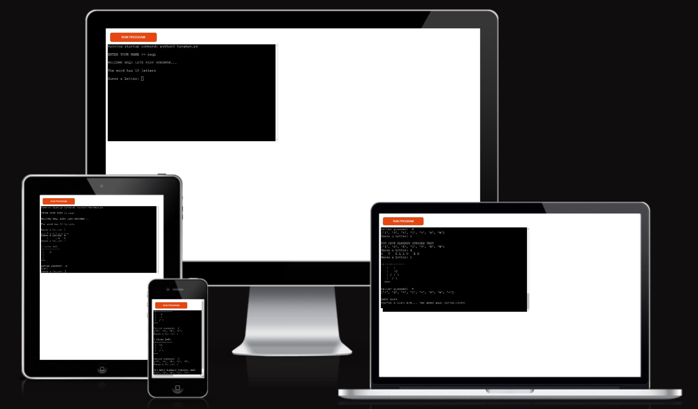
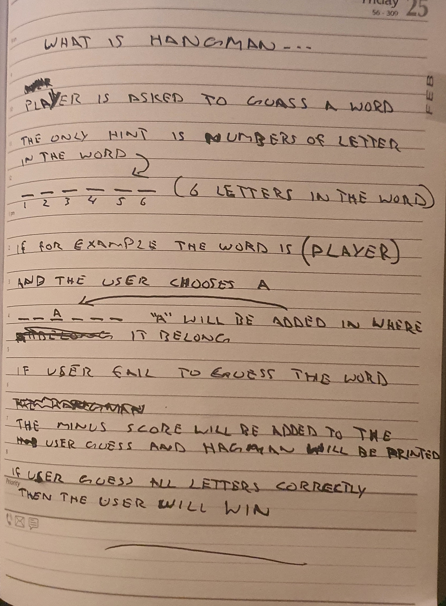
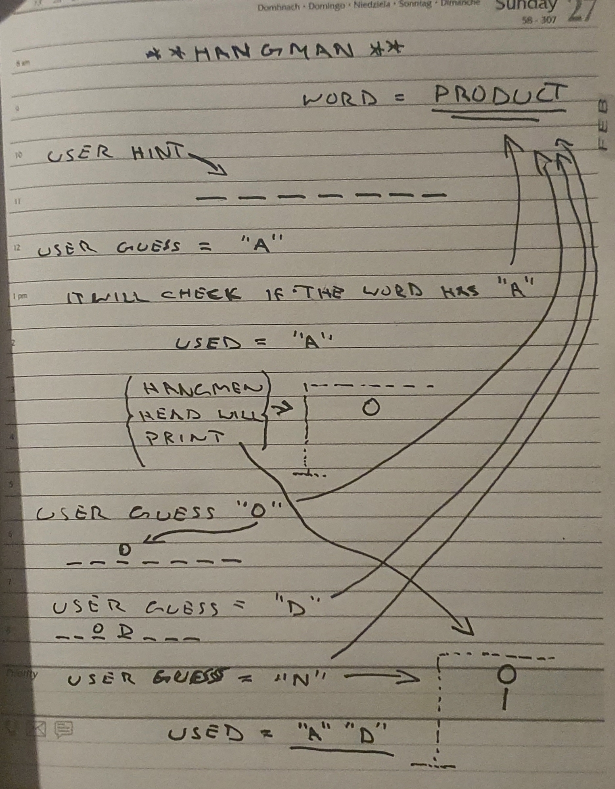
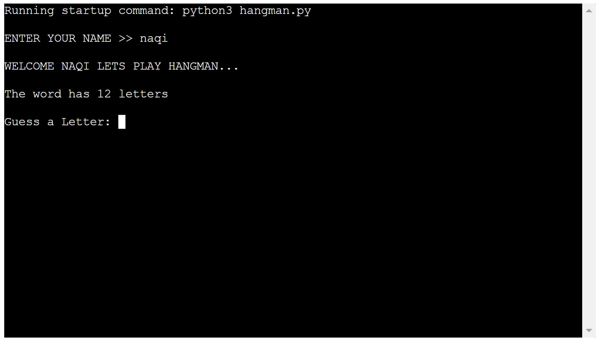
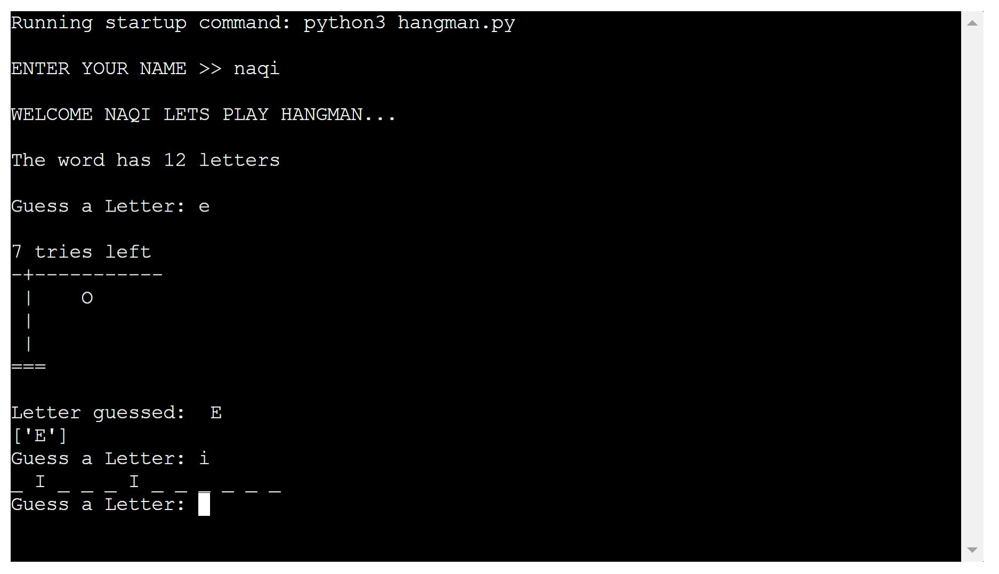
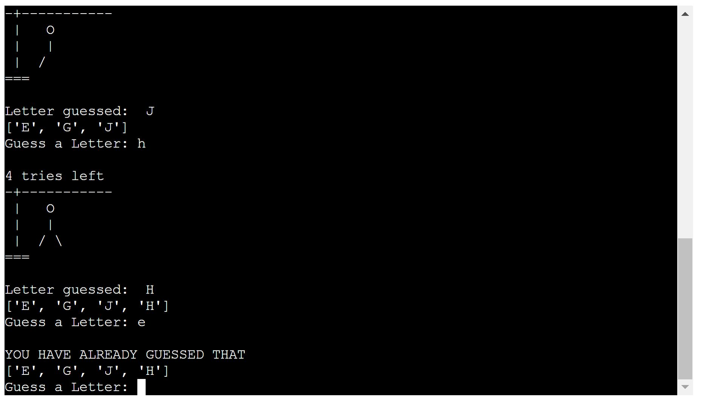
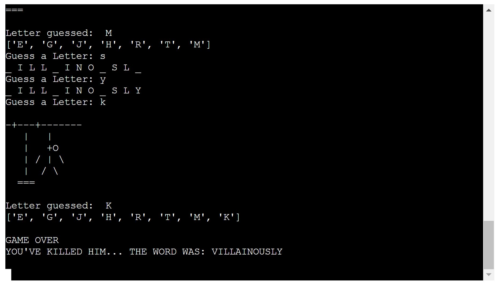
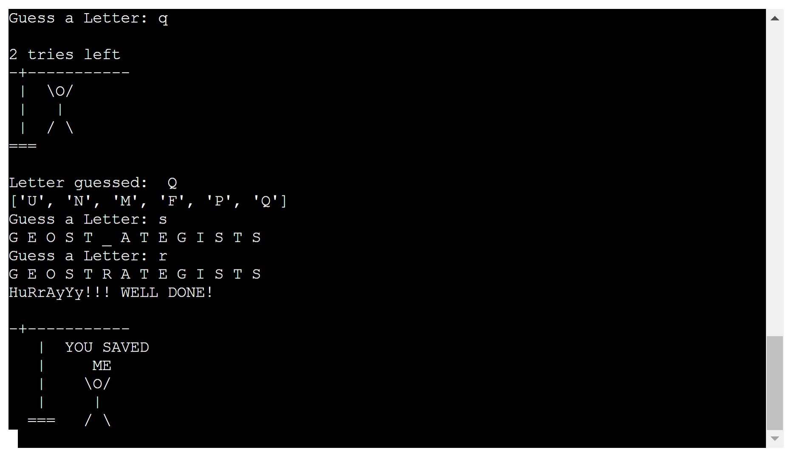
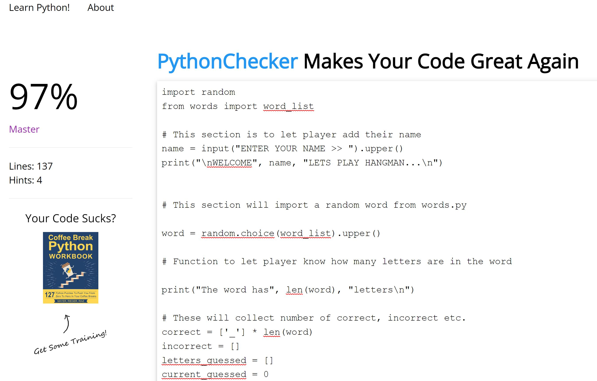
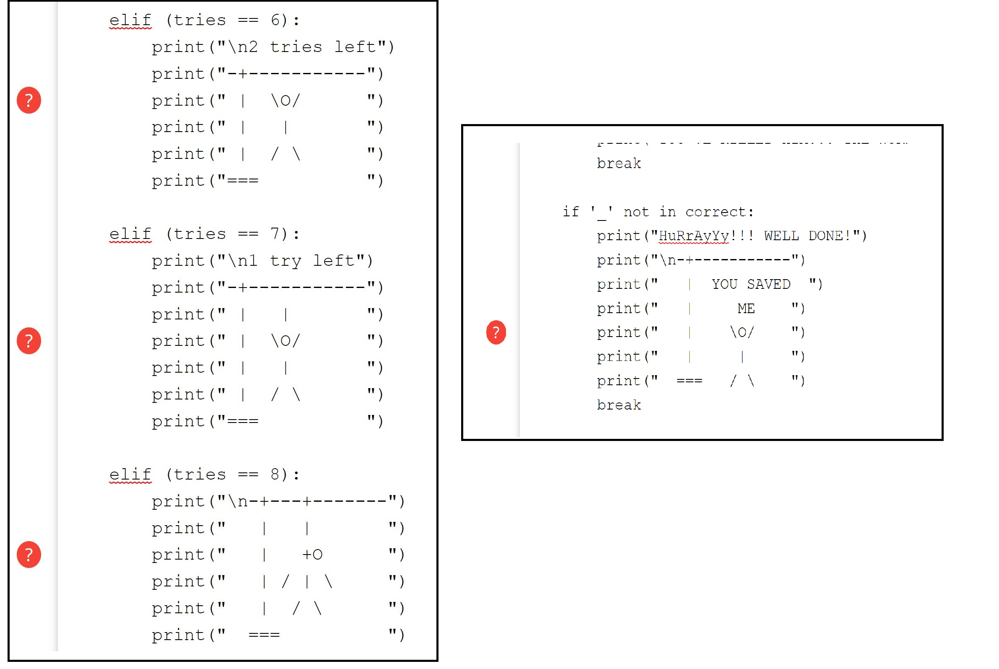

# Hangman

# Goal for this Project
Welcome to Hangman game.
I have created this project to challenge my knowledge about the English words and have some fun at the same time.

# Table of Contents
* [UX](#ux "UX")
    * [User Goals](#user-goals)
    * [User Inputs](#user-inputs)
    * [Owner Goals](#owner-goals)
    * [Requirements](#requirements)
    * [Expectations](#expectations)
    * [Design Choices](#design-choices)
    * [Wireframes](#wireframes)
    * [Features](#features)
        * [Existing Features](#existing-features)
        * [Unfixed Bugs](#unfixed-bugs)
    * [Languages and Websites used](#languages-and-websites-used)
        * [Languages that I used](#languages-that-i-used)
        * [Tools](#tools)
    * [Testing](#testing)
        * [Validation](#validation)
    
    * [Credits](#credits)

# UX

## User Goals
* User can type their name before starting the game.
* Gives enough lives to guess the word.
* Let the user know how many letters are in the word.

## User Inputs
* User can type their name before starting the game so it feels more personal.
* As a user I want to be asked to guess as random words as possible so I can challenge my self.
* As a user I would want to know the length of the word.
* As a user I want to know if I have already used the word that I have typed in.

## Owner Goals
* I have used online word library to choose random word so the user have more options in words.
* Increase the number of visiters.
* Increase rankings on search engines.

### Requirements
* Easy to navigate on various screen sizes.
* Keep the user interested with information to make them want to engage with the Hangman game.
* More words choice for user to guess.

### Expectations
* I expect screen size not to affect the quality of the Hangman game.
* I expect user is informed on every step that how many lives they are left with and what letters they have already guessed.

## Design Choices
* I have designed every step for hangman to be printed if wrong alphabet is typed.
* I have also designed a celebration hangman if user has guessed the word correctly.

# Wireframes
I have manually drew the hangman and steps to complete this project so when I'm working on the codes I will have better idea about the game and I can complete the game correcly and efficiently step by step.

### Understanding the Hangman

### Steps for creating the Hangman game

\
&nbsp;
[Back to Top](#table-of-contents)
\
&nbsp;

# Features

## Existing Features

   ### Main openning 

+ The game openning will ask the player for their name and then welcome the player with their name.
+ And then it will let the player know how many letters are in the word.

    

  ### Guessing the word

    

  ### If letter is already guessed

  + If the letter player has entered and it has already been tried "YOU HAVE ALREADY GUESSED THAT" will be printed.
    

  ### Lost the game

  + If the player couldn't guess the word in the lives given then "GAME OVER, YOU'VE KILLED HIM... THE WORD WAS (WORD)" will be printed.
    

  ### Winning the game
  
  + If the player has guessed all the letters correctly, the Hangman and "YOU SAVED ME" will be printed.
    

## Unfixed Bugs

There are no unfixed bugs.

# Languages and Websites used

## Language that I have used
* [Python](https://www.python.org/ "Python")

## Tools
* [Gitpod](https://www.gitpod.io/ "Gitpod")

## Validation

I have validated my project using [Python Checker](https://www.pythonchecker.com/ "Python Checker") to validate my Python codes.

Below is the validation screenshot.

+ I got 97% correct but there where few errors on the hangman (see below) I'm not sure what I need to do to get these fixed.

\
&nbsp;
[Back to Top](#table-of-contents)
\
&nbsp;

# Formation

Following writing the code then commiting and pushing to GitHub, this project was formed using GitHub and Heroku by the following steps.

## GitHub

+ Navigate to the repository on github and click 'Settings'.
+ Then select 'Pages' on the side navigation.
+ Select the 'None' dropdown, and then click 'master'.
+ Click on the 'Save' button.
+ Now the website is live on [https://hangman-one.herokuapp.com/]
+ If any changes are required or made they can be done by committing and push to GitHub and the changes will be updated.

## Heroku

+ Open Heroku and click on "Create new app"
+ Add app name and choose origin and then click "Create app"
+ Click on the "settings"
+ Scroll down and click on the "Add buildpack" and select the language (make sure to choose Python first and then other language) click "Save changes"
+ Scroll back up and click on the "Deploy"
+ Connect to GitHub by clicking on the GitHub option.
+ Search for the project name and connect.
+ Once connected, scroll down and click on the "Deploy Branch" button.
+ Click on the "Open app" to view live app.

# Credits

I would like to thanks.
* [Simen Daehlin](https://github.com/Eventyret "Simen Daehlin")

And **Kenan Wright**

For code insperation, help, advice and encouragment.

&nbsp;

For code inspirations I went through my notes that I took throughout the course and also I checked out few Youtube videos to understand them better and use them correctly.

I have also looked into a youtube video [https://www.youtube.com/watch?v=8ext9G7xspg&list=WL&index=3&t=2152s&ab_channel=freeCodeCamp.org] for code insperation and to see which way the code will react better.

\
&nbsp;
[Back to Top](#table-of-contents)
\
&nbsp;

